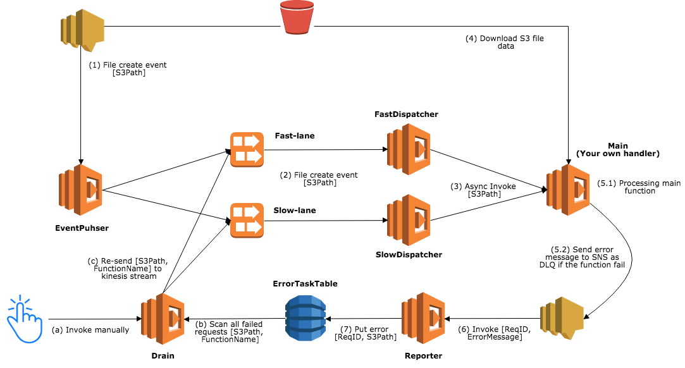

SLIPS: Serverless Log Iterative Processor from S3 
=================

`slips` is framework to process log files that is put into S3 bucket.

Prerequisite
------------

- Python >= 3.6
- AWS credential with permissions to create CloudFormation Stack
- S3 bucket(s)
    - Bucket(s) must send notification of ObjectCreated to SNS. See details in [official document](https://docs.aws.amazon.com/AmazonS3/latest/dev/ways-to-add-notification-config-to-bucket.html).
- aws-cli >= 1.11.190

Setup SLIPS in your project
------------

In your project directory, setup SLIPS by following commands.

```bash
$ virtualenv venv
$ source venv/bin/activate
$ pipenv install -e 'git+https://github.com/m-mizutani/slips.git#egg=slips'
```

And write your meta config file, and save it as `your_config.yml`

```yaml
stack_name: sample-stack
description: this is my app
base:
  sam:
    code_bucket: mizutani-test
    code_prefix: functions

backend:
  sns_topics:
    - name: SecLogUplaod
      arn: arn:aws:sns:ap-northeast-1:1234xxxxxx:seclog-event

handler:
  path: src/handler.py
  args:
    your_key1: value1
    your_key2: value2

bucket_mapping:
  mizutani-test:
    - prefix: logs/azure_ad/signinEvents/
      format: [s3-lines, json, azure-ad-event]
    - prefix: logs/g_suite/
      format: [s3-lines, json, g-suite-login]
```

Then, write your code and save it as `./src/handler.py`.

```python
import logging
import slips.interface


class YourHandler(slips.interface.Handler):
    def __init__(self):
        self._logger = logging.getLogger()
        self._logger.setLevel(logging.INFO)
        
    def setup(self, args):
        self._logger.info('ARGS > %s', args)
        
    def recv(self, meta, event):
        self._logger.info('log meta data: %s', meta)
        self._logger.info('log data: %s', event)

    def result(self):
        return 'ok'  # Return some value if you need.

```

Usage
--------------

NOTE: You should have AWS credential with deploy command such as environment variable `AWS_ACCESS_KEY_ID` and `AWS_SECRET_ACCESS_KEY`.

### Deploy

```bash
$ slips -c your_config.yml deploy
```

Then creating a CloudFormation stack `sample-stack-***` like a following figure.



### Show Error Items

```bash
$ slips -c your_config.yml errors
(----------- snip ------------)
2018-03-29T16:35:15.768Z:  2a45219e-336f-11e8-a549-af410f2364a8  slam-test        logs/2018/03/29/20180329_15.log.gz (1179 byte)
2018-03-29T17:35:14.502Z:  8b0bef71-3377-11e8-9d45-8513ea3507ba  slam-test        logs/2018/03/29/20180329_16.log.gz (7394 byte)
2018-03-29T17:35:15.311Z:  8b895cc2-3377-11e8-b432-85f269890763  slam-test        logs/2018/03/29/20180329_16.log.gz (357 byte)
(----------- snip ------------)
```

Then, you can see a list of error items in ErrorTable.

### Show Error Item Detail

`error` command is avaiable to fetch an argument of the error.

```bash
$ slips -c your_config.yml error 2a45219e-336f-11e8-a549-af410f2364a8
RequestID: 2a45219e-336f-11e8-a549-af410f2364a8
Argument:
[
    {
        "aws_region": "ap-northeast-1",
        "event_time": "2018-04-05T12:00:16.587Z",
        "event_name": "ObjectCreated:Put",
        "bucket_name": "slam-test",
        "bucket_arn": "arn:aws:s3:::slam-test",
        "object_key": "logs/2018/03/29/20180329_15.log.gz",
        "object_size": 1779,
        "object_etag": "fd8fff47866aface4ba9457bba303975",
        "dest_stream": "slam-xxxx-EventFastStream-WVPZDN4SDQW0"
    }
]
```

### Test run with error item

`test` command is avaiable to run test with an argument from stored error in ErrorTable. You need to specify `request_id` with `-r` option.

```bash
$ slips -c your_config.yml test -r 2a45219e-336f-11e8-a549-af410f2364a8
2018-04-06 09:37:12.334 INFO [main.py:59] Event: [
    {
        "aws_region": "ap-northeast-1",
        "event_time": "2018-04-05T12:00:16.587Z",
        "event_name": "ObjectCreated:Put",
        "bucket_name": "slam-test",
        "bucket_arn": "arn:aws:s3:::slam-test",
        "object_key": "logs/2018/03/29/20180329_15.log.gz",
        "object_size": 1779,
        "object_etag": "fd8fff47866aface4ba9457bba303975",
        "dest_stream": "slam-xxxx-EventFastStream-WVPZDN4SDQW0"
    }
]
2018-04-06 09:37:12.334 INFO [main.py:61] Env:
export HANDLER_PATH='"src/handler.py"'
(----------- snip ------------)
2018-04-06 09:37:12.382 INFO [credentials.py:910] Found credentials in environment variables.
2018-04-06 09:37:12.457 INFO [parser.py:94] Downloading slam-test/logs/2018/03/29/20180329_15.log.gz to /var/folders/3_/nv_wpjw173vgvd3ct4vzjp2r0000gp/T/tmpp9vxvuh820180405-72aa6e19-e6e1-6b9a-c4fa-4853aae987f3.log.gz
2018-04-06 09:37:12.459 INFO [connectionpool.py:735] Starting new HTTPS connection (1): s3.ap-northeast-1.amazonaws.com
2018-04-06 09:37:12.631 INFO [parser.py:96] Download completed > None
Traceback (most recent call last):
  File "/Users/mizutani/works/xxx/venv/bin/slips", line 6, in <module>
    exec(compile(open(__file__).read(), __file__, 'exec'))
(----------- snip ------------)
  File "/Users/mizutani/works/xxx/src/some/file.py", line 10, in inspect
    sev_level = float(gd_msg['severity'])
KeyError: 'severity'
```

### Drain and Retry Error Items

```bash
$ slips -c your_config.yml drain
```

Then, error items will be put into Kinesis Stream again (Fast-lane or Slow-lane) and deleted from ErrorTable.


Test for only SLIPS
--------------

```bash
$ git clone git@ghe.ckpd.co:mizutani/slips.git
$ cd slips
$ python setup.py test
```
